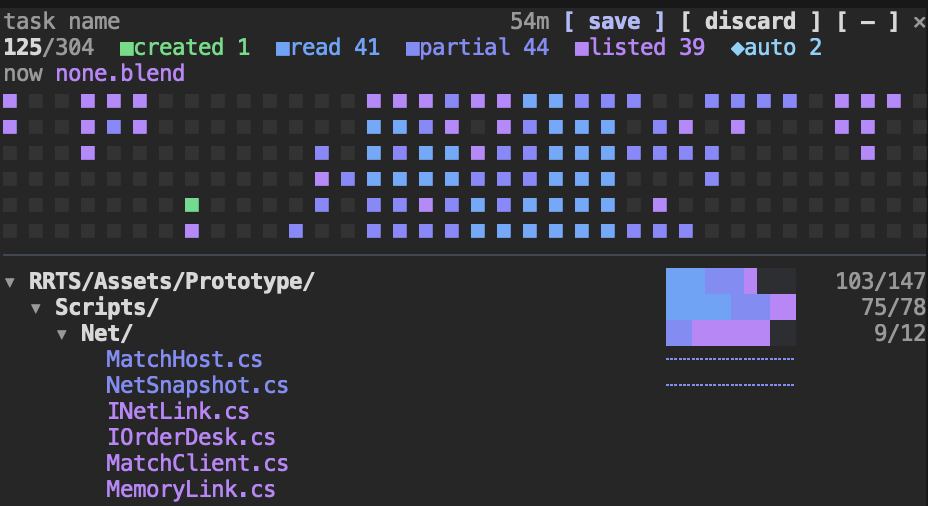
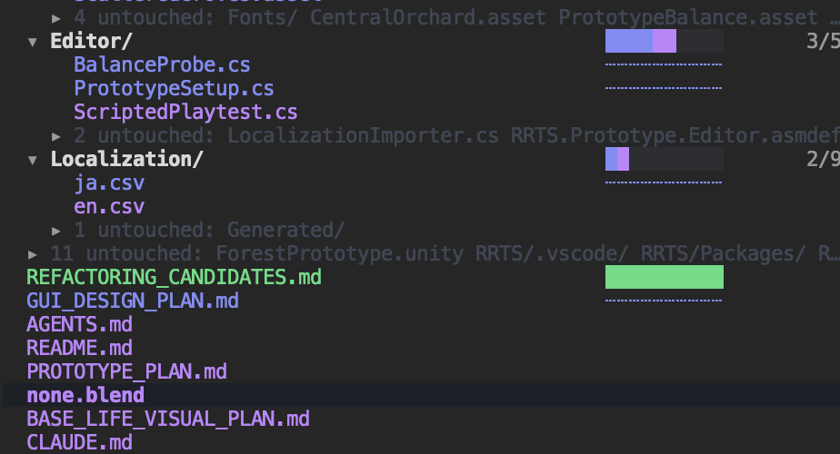

# claude-code-mods

Mods for [Claude Code](https://claude.com/claude-code) by [y-hirakaw](https://github.com/y-hirakaw). So far: [touch-map](#touch-map).

## touch-map

**See how much of your codebase Claude actually looked at.**



You ask Claude something and get an answer. Did it read the file, or only see a few grep matches? Which parts did it never open?
touch-map marks every file Claude touches in this session, down to the lines it read, in a pane beside the conversation.

### Install

```
/plugin marketplace add y-hirakaw/claude-code-mods
/plugin install touch-map@y-hirakaw-mods
```

Then run `/touch-map`. Needs Claude Code 2.1.287 or later.

<details>
<summary>Try it for one session without installing</summary>

```
git clone https://github.com/y-hirakaw/claude-code-mods
claude --plugin-dir ./claude-code-mods/touch-map
```

</details>

### What the colors mean

Each file shows the deepest state it reached.

| State | Meaning | Detected from |
| --- | --- | --- |
|  `created` | Claude made the file | Write, `>` redirects, `mv`, scripts |
|  `edited` | Claude changed the file | Edit, `>>`, `sed -i`, scripts |
|  `read` | Claude saw the whole file | Read, `cat`, `@file` mentions |
|  `partial` | Claude saw only part of it | Read with a line range, `head` / `tail` / `sed -n`, grep matches |
|  `listed` | Claude only saw the name | `ls`, `find`, `grep -l`, `git status` and similar output |
|  `deleted` | Claude removed the file | `rm`, `git rm`, `mv` |
|  `auto` | Loaded into context automatically | `CLAUDE.md` and rules files |

### Reading the pane



- A directory's `■■■■■■■■■■` is the share of its files in each state, then `touched/total`.
- A file has a bar only when Claude did not see all of it: `━━━───` marks the lines it read, `┄┄┄` means only grep matches. A file read in full says so with the color of its name.
- The activity map lays every file out in path order, so files of one directory sit together. A square flashes white when Claude touches it, yellow when a subagent does.
- Click `▾` / `▸` to open or close a directory. Untouched files fold into one `N untouched: …` line.
- `[ save ]` writes the record to `~/.claude/touch-map-logs/` and starts over. It is also saved on `/clear`, compaction and exit.
- The pane's `×` shrinks it to one line above the prompt.
- Subagents and git worktrees count too: a file read inside a worktree is the same path in the repository.

### Commands

| Command | |
| --- | --- |
| `/touch-map` | Open the pane |
| `/touch-map clear` | Save the record and start over |
| `/touch-map discard` | Start over without saving |
| `/touch-map min` | Shrink to one line above the prompt |
| `/touch-map map [on\|off]` | Show or hide the activity map |
| `/touch-map debug [on\|off]` | Write how each event was judged, and the pane as text, to `~/.claude/touch-map-logs/debug/` |

### What it reads, runs and writes

- **Reads** only what passes through Claude Code in this session: tool calls and their results, `@file` attachments and instruction-file loads. Nothing is sent anywhere.
- **Runs** `printenv HOME`, `git ls-files`, `git worktree list` and `git status`, and nothing else, never through a shell. `git status` runs only after a Bash command that may have written files.
- **Writes** `~/.claude/touch-map-logs/<time>.json` when a record is saved, and debug files only while debug output is on.

<details>
<summary><b>Limits</b></summary>

- Bash commands are read heuristically. Script writes are caught with `git status` and modification times, so files ignored by git are not seen, and a file another process writes while the command runs is counted as Claude's.
- On a 50,000-file repository, `git status` adds about 0.1 s per writing command.
- Other sessions (including the background sessions in the agents list) and other terminals are not tracked.
- The activity map is drawn only in the terminal.

</details>

<details>
<summary><b>Development</b></summary>

```
claude plugin validate touch-map
claude plugin test touch-map
```

After Claude Code has loaded the mod once (for example with `--plugin-dir`), its typings are written to `touch-map/.claude-plugin/types/` and `tsc -p touch-map` type-checks it.

</details>

## 日本語

touch-map は、Claude がこのセッションで触ったファイルを created・edited・read・partial・listed・deleted・auto に分けて、会話の横のペインにツリーとアクティビティマップで表示する Claude Code の mod です。触っていないところも畳んで見せるので、「どこまで見て答えたのか」がわかります。色の意味と画面の読み方は、上の表と図のとおりです。

```
/plugin marketplace add y-hirakaw/claude-code-mods
/plugin install touch-map@y-hirakaw-mods
```

外部に何かを送ることはありません。実行するのは `printenv HOME`・`git ls-files`・`git worktree list`・`git status` だけで、書き込むのは `~/.claude/touch-map-logs/` の記録だけです。

## License

[MIT](./LICENSE)
